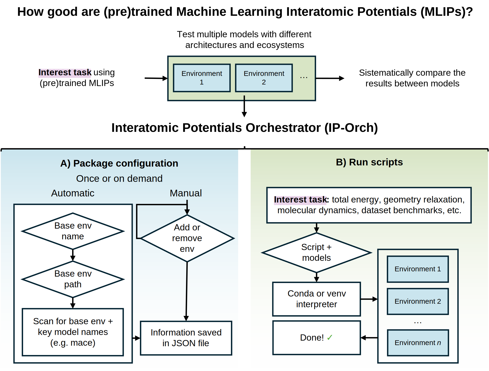

<h1 align="left">
  <picture>
    
  </picture>
</h1>

<!-- <h1 align="left">IP-Orch</h1> -->

<p align="left">
  <!-- <strong>Python package for orchestrating machine learning interatomic potentials (MLIPs).</strong> -->
  Python package for orchestrating machine learning interatomic potentials.
</p>

<p align="left">
  <a href="https://github.com/pedrozanineli/ip-orch/blob/main/LICENSE">
    
  </a>
  <!-- <a href="https://github.com/yourusername/yourproject/releases">
    
  </a> -->
  <a href="https://github.com/pedrozanineli/ip-orch/actions">
    
  </a>
</p>

## Table of Contents

- [Project](#project)
- [Installation](#installation)
- [Usage](#usage)
    - [Configure and register models](#configure-and-register-models)
    - [Run a script across models](#run-a-script-across-models)
    - [Use IP-Orch from Python](#use-ip-orch-from-python)
    - [Saving model results](#saving-model-results)
    - [Reference energy correction](#reference-energy-correction)
- [Contributions and suggestions](#contributions-and-suggestions)
- [License](#license)

<!-- - [Contributing](#contributing) -->

## Project

With the rapid growth of Machine Learning Interatomic Potentials (MLIPs) with different architectures and software ecosystems, a fragmented ladscape has been created, where models are often tied to incompatible dependencies and heterogeneous interfaces. In this scenario, IP-Orch is a lightweight Python package for orchestrating multiple MLIPs, allowing reproducible benchmarking and systematic comparison across models using an unified ASE-based workflow.

<p align="center">
  
</p>

### Features

- Orchestrates a single ASE script across multiple MLIP environments/models.
- Keeps model aliases + configuration in a local config store.
- Provides an interactive setup flow to discover Conda environments.
- Optional post-processing energy correction (linear and element-reference shift).
- Rich terminal output + per-model success/broken status.

## Installation

`IP-Orch` can be installed directly from the source repository using `pip`:

```bash
# Clone the repository
git clone https://github.com/pedrozanineli/ip-orch

# Navigate to the project directory
cd ip-orch

# Install IP-Orch and dependencies
pip install .
```

### Docker image with MACE and Orb

The repository includes `Dockerfile.mlips`, which builds a CUDA-capable image with:

- `ip-orch` installed in the base Python environment.
- MACE models available through `/opt/iporch-envs/mace`.
- Orb models available through `/opt/iporch-envs/orb`.
- A preconfigured `~/.ip-orch/config.json` registering `mace-mp`, `mace-mp-0`, `mace-mpa-0`, `orb-v3`, `orb-v2`, and `orb-v2-mptrj`.

Build locally:

```bash
docker build --platform linux/amd64 -f Dockerfile.mlips -t ip-orch-mlips .
```

Run:

```bash
docker run --platform linux/amd64 --gpus all --rm -it ip-orch-mlips
```

Inside the container:

```bash
ip-orch --run /workspace/ip-orch/examples/calculators_test.py --envs mace,orb
```

The GitHub Actions workflow in `.github/workflows/docker.yml` builds this image on pull requests and pushes it to GitHub Container Registry on pushes to `main` and version tags. The default image name is:

```bash
ghcr.io/pedrozanineli/ip-orch:latest
```

## Usage

### Configure and register models

IP-Orch configuration can be both be done manually or automatically.

```bash
# Interactive discovery/setup
ip-orch --configure

# Manually add (env, model) pairs
ip-orch --add mace mace_mp
ip-orch --add orb orb_v3
```

Available and configured models can be checked using the following:

```bash
# List known model aliases
ip-orch --supported-models
```

### Run a script across models

<!-- Example: `examples/calculators_test.py`. -->
<!-- (or `mlip_entry(...)`). -->

The script must be defined as a `main()` function and receive `calculator_name, calc` as parameters, as shown in the following example:

```python
import sys
from ase import Atoms
from ase import build 

def main(calculator_name, ase_calculator):
    molecule = build.molecule('H2O')
    molecule.calc = ase_calculator
    e_molecule = molecule.get_potential_energy()
    print(f'Molecule energy {e_molecule:.4f} eV')
```

With the configured script and environments, the script can be executed with multiple models. The current available models are 1) using all MLIPs available in a given environment (e.g. all models available from MACE) or 2) specified models configured in the package.

```bash
# 1) Run all configured models for selected environments
ip-orch --run examples/calculators_test.py --envs mace,orb

# 2) Select specific model aliases
ip-orch --run examples/calculators_test.py --models mace-mp,orb-v3

# 3) Run up to N selected models concurrently
ip-orch --run examples/calculators_test.py --models mace-mp,orb-v3 --parallel 2
```

By default, IP-Orch runs selected models sequentially. The `--parallel N` option runs up to `N` selected models concurrently, which can reduce benchmark wall time when the available hardware resources can support multiple simultaneous model evaluations.

### Use IP-Orch from Python

IP-Orch can also be called from a Python script, without going through the command-line parser. The same configured environments and models are used. The first argument can be either a script path or a Python function that receives `calculator_name, ase_calculator`:

```python
from ase.build import bulk

from ip_orch import IPOrch

def calculators_test(calculator_name, ase_calculator):
    atoms = bulk("Cu", "fcc", a=3.6)
    atoms.calc = ase_calculator
    energy = atoms.get_potential_energy()
    print(f"{calculator_name}: {energy:.6f} eV")

orch = IPOrch()
orch.run(
    calculators_test,
    models=["mace-mp", "orb-v3"],
    parallel=2,
)
```

When passing a function from a notebook, IP-Orch reconstructs a temporary worker script from the function source and simple globals such as imports and constants. If the function depends on complex objects created in earlier cells, define those objects inside the function or use the path-based form instead.

Selections can use either `envs=[...]` or `models=[...]`, matching the CLI behavior. A non-zero status code is returned by default; pass `raise_on_error=True` to raise a `RuntimeError` instead. The path-based form is also supported:

```python
from ip_orch import IPOrch, RunOptions

options = RunOptions(
    script="examples/calculators_test.py",
    envs=["mace"],
    correction_elements=["C", "Cu"],
    reference_energy_source="precomputed",
)

IPOrch().run_with_options(options, raise_on_error=True)
```

The other CLI actions are available as methods too. These methods print their command output and return `None`, so they do not echo a trailing `0` in notebooks or interactive scripts.

```python
from ip_orch import IPOrch

orch = IPOrch()
orch.add_model("mace", "mace-mp")
orch.supported_models("mace")
orch.check_elements("mace-mp", ["C", "Cu"])
orch.remove_model("mace", "mace-mp")
```

### Reference energy correction

Taking into consideration that Machine Learning Interatomic Potentials can be trained with different datasets, their predicted absolute energies may not be directly comparable due to shifts in reference energy. To address this, `IP-Orch` provides an optional reference energy correction scheme.

This correction computes element-wise reference energies using the same MLIP (e.g., isolated atoms in a large non-periodic box) and subtracts their contribution from the total energy of a structure, based on its composition. The set of elements can be specified via the `--correction_elements` flag. By default, the reference energies are evaluated from the MLIP itself. Alternatively, `--reference-energy-source precomputed` reads bundled values from `ip_orch/scripts/reference_energies.csv`, avoiding the isolated-atom preflight. This approach aligns the energy zero across different models, enabling consistent comparison of quantities such as formation, surface, and interaction energies. This correction can also be combined with an optional linear adjustment of the energy (via `--energy-linear-a`, `--energy-linear-b`, and `--energy-linear-mode`) to account for systematic scaling differences between models.

GRACE, MatRIS, and M3GNet calculators are not used for computed isolated-atom reference energies. They also do not have bundled precomputed reference energies in `reference_energies.csv`.

```bash
# Linear correction
ip-orch --run examples/calculators_test.py \
        --envs mace \
        --energy-linear-a 1.02 \
        --energy-linear-b -0.10 \
        --energy-linear-mode total_energy

# Element-reference shift (auto computed from the MLIP itself)
ip-orch --run examples/calculators_test.py \
        --envs mace \
        --correction_elements Cu

# Element-reference shift from bundled precomputed values
ip-orch --run examples/calculators_test.py \
        --envs mace \
        --reference-energy-source precomputed

# Optionally limit the bundled references to selected elements
ip-orch --run examples/calculators_test.py \
        --envs mace \
        --reference-energy-source precomputed \
        --correction_elements Cu

# Check whether a model has precomputed references for selected elements
ip-orch --check-elements mace-mp C,Cu

# Disable any correction
ip-orch --run examples/calculators_test.py \
        --envs mace \
        --no-energy-correction
```

### Saving model results

IP-Orch runs the user script once per selected model, so scripts should save their own outputs when results need to be compared later. A simple pattern is to append one row per model to a CSV file:

```python
import csv
from pathlib import Path

def main(calculator_name, ase_calculator):
    energy = ...
    row = {"model": calculator_name, "energy_ev": energy}
    csv_path = Path("results.csv")

    write_header = not csv_path.exists()
    with csv_path.open("a", newline="", encoding="utf-8") as handle:
        writer = csv.DictWriter(handle, fieldnames=row.keys())
        if write_header:
            writer.writeheader()
        writer.writerow(row)
```

The graphene bilayer example follows this approach and writes to `graphene_bilayer_results.csv` by default. The output path can be changed with:

```bash
IPORCH_RESULTS_CSV=results/bilayer.csv ip-orch --run examples/bilayer.py --models mace-mp,orb-v3
```

## Reference

A paper is under development.

## Contributions and suggestions

For bugs or feature requests, please use [GitHub Issues](https://github.com/pedrozanineli/ip-orch/issues).

## License

IP-Orch is published and distributed under the MIT License.
